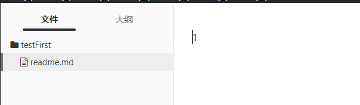
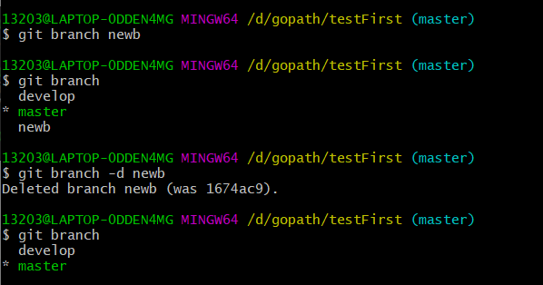

# 基本概念

首先要说明的是这篇笔记只是快速上手，并没有原理讲解，如果学的时候感觉迷惑，请自行百度原理。

本篇希望你阅读完成之后可以快速上手使用git进行团队协同开发。


Git[/gɪt/] 是一个开源的分布式版本控制系统，用于敏捷高效地处理任何项目。

git的诞生是已经听的耳朵起茧的Linus Torvalds为了维护Linux而用十天发明的版本管理系统


# 安装

参考[菜鸟教程](https://www.runoob.com/git/git-install-setup.html)

## 配置

其中用户信息是一定要设置的，其他的配置在入门的时候可以先不看。

# 流程理解

首先上一张特别有名的图


简单解释一下

- workspace是你的工作区
- staging area是暂存区
- localrepository是本地仓库
- remote repository是远程仓库

# 操作流程

## 基本操作

### 创建

首先要做的肯定是创建一个新的项目，这里有两个选择：clone 和 本地创建

#### 克隆

​	一个是先在GitHub等代码托管平台创建或者直接找到别人的项目，复制他们的url


然后在你选好的文件夹右键鼠标找到`git bash`进入git的命令行，注意的是这里的命令行风格和windows的cmd命令不同，他和Linux的命令行是一样的。

在命令行中输入`git clone 你刚刚复制的url`


这里面的蓝色区域都是自动生成显示的，红色的是要输入的。

此时再看刚刚的文件夹，发现里面就多了刚刚克隆的项目文件夹了


#### 创建

第二种方式就是在本地init

在任意一个项目中，输入`git init`就可以完成初始化


完成后刷新文件夹，发现之前的文件夹中多出来一个.git文件夹，如果没有很有可能是文件夹没有设置显示隐藏文件，因为这个文件是默认隐藏的。


### add

我现在在刚刚新建的文件夹中创建了一个叫做readme.md的文件，并且在里面输入了一个1



现在这个文件夹就是你的工作空间，也即是我刚刚的操作对你的workspace进行了修改。

你平时在workspace写代码，写完一部分就可以通过执行`git add .`把他添加到staging area(以为通常都是将目录下所有的文件全部添加，所以后面添加一个.


### commit

之后要添加到本地的仓库中，使用的是`git commit -m '描述'`值得注意的是Windows的cmd格式中必须使用双引号，这段指令的含义是将文件添加到本地仓库，并且附加一个描述。


现在你已经学会了在本地使用git的单分支开发，但是这样未免有点简单，在我看来git的最大优势是版本控制，也就是分支管理，但是我只有一个分支又和谈分支管理呢，所以接下来外面要学习的是分支管理

## 分支管理

### 查看已经存在的版本

```bash
$git branch
```


看到这里只有一个master分支，并且前面有一个*，也就是说明本地（注意是本地）只存在一个分支，并且正在使用。

### 创建分支

```
$git branch 分支名字
```


按照上图所示，我创建了一个叫做develop的分支，但是我并没有切换切换分支


也可以设置指定的参考模板进行创建

```bash
$git checkout <newbranchname> <refbranch>
```

以参考分支为模板创建新分支


`git checkout branch_name`


如上所示，使用了这个指令之后，使用的分支被修改了

现在外面对现在用的这个分支进行修改，用来模拟我们在开发的时候在自己的开发分支进行了修改。


具体步骤也就是重复基本操作的那几步。


现在我们在切换回到master分支看看之前的分支有没有变化。


可以看到的是，在master分支的文件中，这里还是1不是2，这说明对另一个分支的修改对其他分支不会产生影响。

可以把分支想象成一个克隆人（当然这在现实中的法律和道德都是不允许的），当一个人被克隆之后，在最开始他的克隆人是和他一模一样的，但是在分开之后他们就是两人了，他们的生老病死就再也不相关了。


### 分支合并

首先保证在master分支，因为分支合并会将其他分支合并到当前使用的主分支上。

执行命令`git merge new_branch_name`


现在我们再看一下master分支下的readme.md文件


发现发生了修改。

#### 冲突解决

为了创造冲突，我们首先再master的分支下将readme的数字改为3


再进入develop分支，将数字改为4；


现在再进入master分支进行分支合并


这个时候显示的是产生冲突，合并失败，我们再进入readme.md中看看里面怎么样了。


在这里我们可以很明显看到产生冲突的地方，如果在ide中会更加明显，甚至回给你快捷间进行快速解决冲突。在这里我们必须要手动进行解决。


现在冲突以及手动解决了，接下来我们要告诉git我们以及把问题解决了，你可以继续合并了。


这个样子就完成了合并。

### 删除分支

```bash
$git branch -d branchname
```

这个指令是对分支进行删除



上述操作完成了一个分支的创建和删除

### 分支重命名

```bash
$ git branch -m oldName  newName
```


如上就是对分支进行了重命名。


通过以上的使用，你已经可以在本地使用git进行版本控制的开发，但是相信很多人一开始接触git的开发都是因为需要团队写作，因此我们接下来介绍本地的仓库如何和远程仓库交互起来。

## 远程仓库

以下的托管平台使用的是GitHub，如果又需要使用gitee的需求同理

### 基础

因此这个笔记就是托管在了GitHub上，因此我默认你已经学会GitHub的基本使用了。

我们首先来创建一个远程仓库


### 添加远程仓库

首先是查看配置的远程仓库

```bash
$git remote
```


现在如果你的文件夹是使用git init来创建的，现在没有和远程的仓库相关联，那么我们如何关联起来呢


首先在刚刚创建好的页面找到他的url，空的项目应当在这里很明显。

```bash
$git remote add shortname url
```


如上图我们就给他创建了一个关联。

但是我们git和GitHub之间的通信是加密的，我们需要给他们设置ssh key

这里我们就不细讲了。可以去网上找一篇文章

比如我刚刚找到的https://www.likecs.com/show-204243438.html


当加上参数-v的时候可以看到给他设置的地址。

### 拉取

设置了仓库之后的第一步肯定是对拉取仓库里面的数据。

这里有两条路可走

先上网图


#### 好事多磨型

```bash
$git fetch
$git merge
```

开始的get fetch拉取远程仓库的分支资源

后面的git merge 将两个分支进行合并

这一套下来，本地的电脑上的资源就和远程仓库的资源同步了

具体理解可以参考这个[博客](https://blog.csdn.net/qq_42780289/article/details/98049574)

#### 一步到胄型

上述多少有点麻烦，因此更简单的`git pull`就很吸引人了。

```bash
$ git pull origin develop
```

**建议每次提交代码之前都要执行一下**，以防止远程仓库已经被你的同事更新了，以和最新的仓库合并。

### 提交

```bash
$git push  origin [<loacl branchname>:<remote branchname>]
```

给个栗子


因为第一遍执行之前远程仓库还没有任何分支，因此没有指定远程仓库的分支

第二次的时候加入了远程仓库的分支名字，注意两个名字和冒号之间没有空格，不然会报错；

现在再看一下GitHub


发现已经数据已经更新了，并且和本地master的数据同步了。

# 补充

## 文件状态

```bash
$git status
```

查看文件的状态

文件状态有以下几种

- 还没有被add的文件叫untracked，在IED中会被标红，简直强迫症的噩梦
- 被add之后文件处于staged状态，等待被commite
- commit之后文件处于unmodified
- unmodified的文件被修改则会IED变为modified状态
- modified之后的文件add之后将继续变为staged状态
- 当unmodifed的文件不再需要，那么可以remove，不再追踪变为untracked状态

## 设置命令简写

使用命令行的时候常常被长的一批的指令给气死，好在我们的git已经想到给我们提供了命令简写设置。

这个文件在用户根目录下，叫做.gitconfig，这个文件也是隐藏的，因此需要设置显示才能看到

可以使用指令

```bash
$vim ~/.gitconfig
```

 之间进去编辑，这里的编辑工具是vim，具体使用请学习Linux的vim指令。

这里简单提一下按字母i进入编辑模式，编辑完成后按下Esc退出编辑模式，进入命令模式，接下来按冒号:健，进入底线命令模式，最后输入wq然后回车就完成了文件编辑的保存和退出。


在里面加入标签[alias]

在下面写入简写，左边是简称，右边是原来的指令。

以后再写`git st`就和`git status`一样了。

方便快捷。

## 回滚

回滚也是一个很重要的概念，他是用在你觉得新开发的版本没有之前的好，这样就可以使用回滚回到之前的版本；

### 得到回滚版本的id

```bash
$git log
```

查看日志，找到想要回去的版本的commit id

在通过commit时候的信息和提交时间、提交人等信息锁定版本。


可以复制整个的commit id也可以只选择他的前七位。

### 进行回滚

使用指令

```bash
$ git reset --hard [commit id]
```

就可以回到commit id对应的版本了；

可以看到，我们已经回到4的这个版本了


